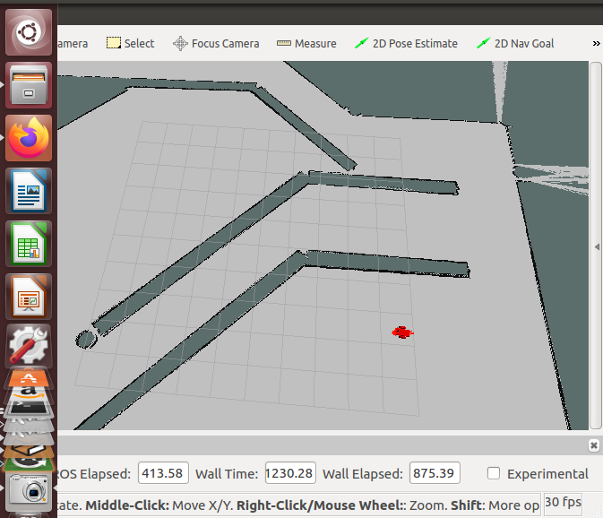

# Where Am I?

The goal of this project is to built Differential wheeled robot that uses information from `laser-sensor` and `camera` to localize itself through the `amcl pkg` to estimate the robot's own pose .`However`, to successfully apply the algorithm, there are many `parameters` to tune for the specific robot and env, `config.files` contains up-to-date parameters  . See my `pdf` for an extended discussion 

 


# Project Setup
The project was developed on `Ubuntu 16.04 LTS` with ROS Kinetic, Gazebo and catkin installed.
Update system: `sudo apt-get update`

1.Create catkin workspace:

```
$ mkdir -p ~/catkin_ws/src
$ cd ~/catkin_ws/src
$ catkin_init_workspace
$ cd ~/catkin_ws
$ catkin_make
```

2.Install ROS packages used in this project.
```
$ sudo apt-get install ros-kinetic-navigation
$ sudo apt-get install ros-kinetic-map-server
$ sudo apt-get install ros-kinetic-move-base
$ sudo apt-get install ros-kinetic-amcl
```
3.Clone my github repository

4.Build.

`$ catkin_make`

After the above steps, you should be able to run the commands below in separate terminals:

```
roslaunch udacity_bot udacity_world.launch
roslaunch udacity_bot amcl.launch
rosrun udacity_bot navigation_goal
```

